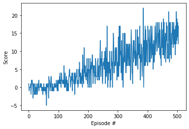

#  Project1: Navigation - Solution

### Deep Q-Network.
As a baseline solution I implemented a DQN-agent as in the `LunarLander_v2` [exercise](../../../DQN/), 
since the same solution could also applied here with small modifications. The underlying idea for the DQN-Agent you can 
find in DeepMind's 2015 [paper](https://storage.googleapis.com/deepmind-media/dqn/DQNNaturePaper.pdf)

For the solution I implemented a rather wide 5 layer deep NN. However there wasn't any optimization step through the 
process, fortunately the base architecture seemed working here. 

To execute the solution [notebook](Navigation_solution.ipynb), please place the required folder of the Unity environment 
to the parent folder or modify the reference in the notebook cell accordingly. 

I implemented a rather simple 5 layer deep FC network with [512-256-128-64-32] neurons in the layers. 
For the activations I choose to use Scaled Exponential Linear Units (SELUs) you can find additional information about 
them in [this](https://arxiv.org/pdf/1706.02515.pdf) paper. The solution is based on the DQN exercise, 
which you can find [here](https://github.com/udacity/deep-reinforcement-learning/tree/master/dqn). 
The agent is defined in the `nav_agent.py` [file](./nav_agent.py), where we use two separate networks with the same 
architecture. The target Q-networks weights are updates less often than the local Q-networks weights to increase the 
speed of convergence. The approach is called fixed Q-network. 

The following parameters are defined for the agent:
```BUFFER_SIZE = int(1e5)  # replay buffer size
BATCH_SIZE = 64  # minibatch size
GAMMA = 0.99  # discount factor
TAU = 1e-3  # for soft update of target parameters
LR = 5e-4  # learning rate
UPDATE_EVERY = 4  # how often to update the network
```
Buffer size defines how many past experiences should the agent hold (memory). As the agent interacts with the 
environment we add experience tuples to the buffer, which are containing the information about the current state, 
the current action, the reward for the current action and the next state and a binary variable indicating if the episode 
is finished. Since the records in the memory are added sequentially they are highly correlated, thus to 'break' this 
correlation we take a random sample from it. 

The `BATCH_SIZE` parameter is the size of the random sample we take from the memory for the learning. 
`GAMMA` is the discount factor, which is the weight for the next Q value.
`TAU` is 'persistence' parameter for the update of the target Q-network weights with the local Q-networks weigths. 
`LR` is the learning rate for the optimizer (`Adam` in our case).
`UPDATE_EVERY` how often should the agent learn (take sample fo buffer and update the weights).
 
 
 With the current approach the agent solved the task in 405 steps. 
 
 
 


### Future work

I plan to add different approaches to the solution to be able compare the results. First I plan to implement learning 
from pixels, afterwards would like to go through the variuos improvements of DQN: 

- **Double DQN**
- **Dueling DQN**
- **Prioritized Experience Replay**
- **A3C**
- **Distributinal DQN**
- **Rainbow**


### Deep Q-Network - Pixels

In progress, following soon...:)
