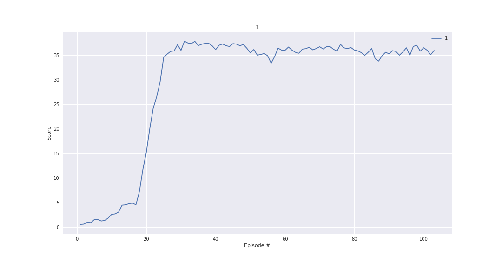
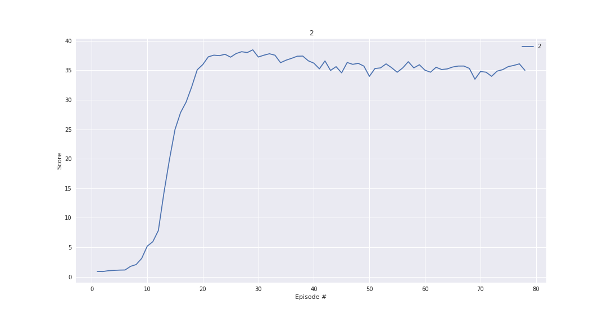
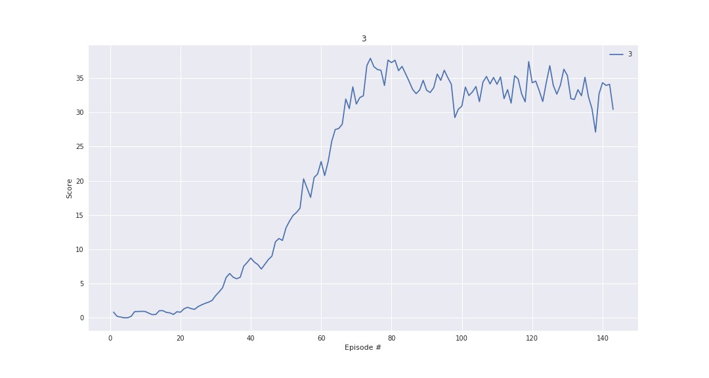

# Project report - Continuous Control

## 1. Introduction - experiment setting

During the experimentation for the project solution the environment with 20 seemed to converge faster, thus I decided to
 use that as 'baseline' for my solutions. 
 During the assigment we train the agent with `Deep Deterministic Policy Gradient` algorithm. You can find an 
 outstanding description about it [here](https://spinningup.openai.com/en/latest/algorithms/ddpg.html).

 During the projet work as first step I reviewed the previous exercises for the actor-critic methods:
  - [ddpg - bipedal](https://github.com/udacity/deep-reinforcement-learning/tree/master/ddpg-bipedal)
  - [ddpg - pendulum](https://github.com/udacity/deep-reinforcement-learning/tree/master/ddpg-pendulum)

As next step I decided to restructure the problem and solution a bit, by making the underlying neural-network 
architectures a bit more configurable, parameterizable, but the baseline for the project solution is stemming from the 
above examples. 

The actor and critic networks are defined [here](./model.py). The agent itself is implemented [here](./ddpg_agent.py). 
I also decided to include the additional functions regarding training and presenting the solved environment 
[here](./ddpg_utils.py).

The experiment can be defined as a dictionary as in the following example:
```python
agent_params = {
    'ACTOR_HIDDEN_LAYERS': [400, 300],
    'CRITIC_HIDDEN_LAYERS': [400, 300],
    'USE_BATCH_NORM': True,
    'ADD_NOISE': True,
    'GRAD_CLIP': False,
    'BUFFER_SIZE': int(1e5),
    'BATCH_SIZE': 128,
    'GAMMA': 0.99,
    'TAU': 1e-3,
    'LR_ACTOR': 1e-4,
    'LR_CRITIC': 1e-4,
    'WEIGHT_DECAY': 0,
    'UPDATE_EVERY': 1,
    'UPDATE_FREQ': 1,
    'USE_XAVIER': False,
}
```


 - *_HIDDEN_LAYERS - defining the structure of the NNs
 - BATCH_NORM - whether to use batch normalization in the NNs between the layers
 - ADD_NOISE - whether to use Ornstein-Uhlenbeck noise during training
 - GRAD_CLIP - whether to use gradient clipping (1)
 - BUFFER_SIZE - memory to store agent's experience
 - GAMMA - discount factor
 - TAU - interpolation for soft update
 - LR_* - learning rates for the actor and critic networks
 - WEIGHT_DECAY - parameter for Adam-optimizer
 - UPDATE_EVERY - update weights in every nth timestep
 - UPDATE_FREQ - updating the actor and critic networks n times at every timestep
 - USE_XAVIER - use [Xavier weight init](https://pytorch.org/docs/stable/_modules/torch/nn/init.html#xavier_normal_) 
 instead of the baseline  

After predefining the experiments they can be appended to a list and loop over it saving the results to a predefined 
location as in the [notebook](./solution.ipynb)


## 2. Experiments 

As a baseline I used the above example, with the 20 agent version of the environment, it was solved in 103 episodes 
total.




Next I decided to check the effect of using deeper networks:

```python
agent_params1 = {**agent_params,
                 'ACTOR_HIDDEN_LAYERS': [400, 300, 200, 100],
                 'CRITIC_HIDDEN_LAYERS': [400, 300, 200, 100],
                 }
```
Which resulted in solving the environment faster, in 78 episodes.


As next step I decided to use the original parameters, but with a higher learning rate for the actor, which made the
convergence a bit more unstable, the variance was higher, the environment was solved in 143 episodes. 



Next I decided to try the combination of the above changes: higher learning rate and deeper networks:


## 3. Extensions - next steps:

- [ ] Include activation function in params - make networks as customizable as possible.
- [ ] Implement integration with [Optuna](https://github.com/optuna/optuna) for parameter search.
- [ ] Spike integration possibilities with [Ray - Rllib](https://docs.ray.io/en/master/rllib.html) as a distributed 
example.


